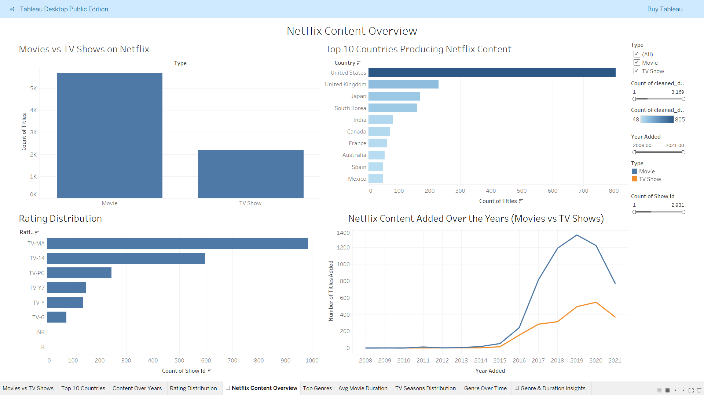
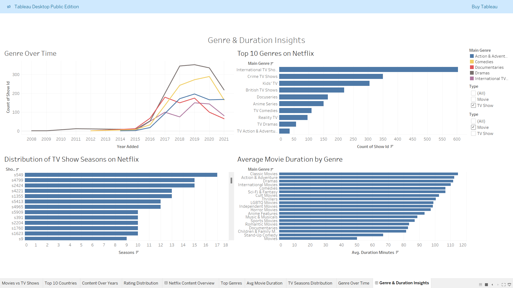

# 🎬 Netflix Content Analysis Dashboard

## 📊 Dashboard Preview

### Netflix Content Overview

### Genre & Duration Insights

## 🗂️ Table of Contents

1.🎯 Project Objective & Summary

2.📦 Problem Statement & Business Problem

3.📌 Business Objectives

4.🧾 Project Overview 

    5.⚙️ Project Setup, Code Organization & Usage
    ├── 🏗️ Project Setup
    ├── 💻 Installation Instructions
    ├── 📂 Folder Structure & Code Organization & Implementation
    ├── ▶️ Usage / How to Run
    └── 🌐 Live Demo / Deployment Link

6.🧩 Dataset Information (Data Source, Data Details & Data Dictionary)

7.🧰 Tools,Technologies & Skills Used

8.🧮 Steps / Methodology / Approach

9.🐍 Code / Implementation (Python)

10.🧠 Exploratory Data Analysis (EDA) & Visualizations

11.📈 Analysis , Modeling, Dashboard Creation (Tableau) ,  Dashboard Screenshots (Tableau)  & Visual Outputs 
    
12.💡 Key Insights, Findings & Business Takeaways

13.❓ Key Questions to Answer

14.🚀 Challenges, Gotchas & Learnings

15.🗂 Deliverables

16.🗄️ Business Impact

17.⚙️ Skills Demonstrated

18.📚 References & Resources

19.👨‍💻 Authors / Contributors

20.📜 License

21.🏁 Conclusion

## Step 1.🎯 Project Objective & Summary

* The primary objective of this project is to analyze Netflix’s content catalog to uncover meaningful insights about content distribution, genre popularity, country-wise production, and historical growth trends. With the rapid expansion of streaming platforms worldwide, understanding content patterns has become essential for media companies to make strategic content acquisition and production decisions.

* In this project, the Netflix Movies and TV Shows dataset is explored using Python for data preprocessing and exploratory analysis, followed by interactive dashboard creation using Tableau. The analysis focuses on identifying trends in content types, genres, ratings, countries of production, and release timelines.

* By transforming raw dataset records into meaningful visual insights, this project demonstrates the full lifecycle of a modern data analytics workflow — including data ingestion, cleaning, transformation, analysis, visualization, and insight generation. The final output is an interactive dashboard that allows users to explore Netflix content trends dynamically.

* This project showcases practical data analysis skills that are commonly required in real-world analytics roles, such as data wrangling, feature engineering, data visualization, and storytelling with data.

## Step 2.📦 Problem Statement & Business Problem

* Streaming platforms such as Netflix host thousands of movies and television shows from multiple countries and genres. With such a vast catalog, it becomes difficult to understand patterns in content creation, genre popularity, and regional representation without proper data analysis.

* The business challenge lies in identifying which types of content resonate most with audiences, which regions contribute the most content, and how Netflix’s catalog has evolved over time.

* Without data-driven insights, content strategy decisions may rely solely on intuition rather than evidence. This can lead to inefficient investments in content production and acquisition.

* Therefore, this project addresses the need to analyze Netflix’s catalog data systematically to answer key strategic questions such as:

    * Which genres dominate Netflix’s catalog?

    * Which countries produce the most Netflix content?

    * How has Netflix’s content library grown over time?

    * What type of content (Movies vs TV Shows) is more prevalent?

* By analyzing these patterns, the project helps simulate how streaming companies can leverage data to guide business strategy and optimize content investment.

## Step 3.📌 Business Objectives

* The business objectives of this analysis focus on transforming raw Netflix dataset information into actionable insights that can support content strategy and platform growth.

* The key objectives include:

    * Understanding the distribution of Movies versus TV Shows on Netflix.

    * Identifying the most common genres available on the platform.

    * Analyzing which countries produce the most Netflix content.

    * Examining the trend of content additions over time.

    * Understanding how content ratings are distributed across the platform.

* Discovering how Netflix’s catalog has evolved in terms of genre diversity and global representation.

* These objectives help illustrate how data analytics can be applied to guide strategic decision-making in the entertainment and media industry.

## Step 4.🧾 Project Overview

* This project demonstrates a complete end-to-end data analytics workflow starting from raw dataset acquisition to dashboard-based storytelling.

* The workflow consists of the following major phases:

    * Data Collection from Kaggle.

    * Data Cleaning and Transformation using Python.

    * Exploratory Data Analysis to identify patterns.

    * Feature Engineering for deeper analysis.

    * Data Visualization through Python plots.

    * Dashboard Development using Tableau.

    * Insight Generation and Business Interpretation.

* The project integrates multiple technologies including Python, Pandas, Matplotlib, Seaborn, and Tableau to simulate a real-world analytics pipeline.

* The final deliverable is a set of interactive dashboards that present the insights in a visually intuitive manner, enabling stakeholders to quickly interpret trends in Netflix’s content library.

## Step 5. ⚙️ Project Setup, Code Organization & Usage
            ├── 🏗️ Project Setup
            |── 💻 Installation Instructions
            ├── 📂 Folder Structure & Code Organization & Implementation
            ├── ▶️ Usage / How to Run
            └── 🌐 Live Demo / Deployment Link
### 🏗️ Project Setup

* The project is organized using a modular folder structure to ensure maintainability and reproducibility. Raw data, processed datasets, notebooks, visual outputs, and dashboards are stored separately to keep the workflow organized.

* This structure helps data analysts collaborate easily and maintain clear documentation of the entire pipeline.

### 💻 Installation Instructions

#### Clone repository
git clone https://github.com/<your-username>/Netflix_Content_Analysis.git

#### Navigate to project
cd Netflix_Content_Analysis

#### Install dependencies
pip install -r requirements.txt

### 📂 Folder Structure & Code Organization & Implementation

    netflix_content_analysis/
    ├── data/
    │   ├── raw/
    │   │   └── netflix_titles.csv
    │   └── processed/
    │       └── cleaned_data.csv
    │
    ├── notebooks/
    │   ├── 01_data_loading.ipynb
    │   ├── 02_data_cleaning.ipynb
    │   └── 03_eda_visualization.ipynb
    │
    ├── dashboards/
    │   └── Netflix_Overview_Dashboard.twbx
    │
    ├── Dashboard_Screenshots/
    │   ├── netflix_overview.png
    │   └── genre_duration_insights.png
    │
    ├── outputs/
    │   └── visuals/
    │       ├── content_type_distribution.png
    │       ├── country_wise_content.png
    │       ├── genre_distribution.png
    │       ├── content_by_year.png
    │       └── rating_breakdown.png
    │
    ├── README.md
    └── requirements.txt

### ▶️ Usage / How to Run

* Download the dataset from Kaggle.

* Dataset Link : https://www.kaggle.com/datasets/shivamb/netflix-shows/data

* Place the dataset in the raw data folder.

* Open the notebooks in /notebooks/ for Python analysis.

* Run the notebooks in the following order:

    * 01_data_loading.ipynb
    * 02_data_cleaning.ipynb
    * 03_eda_visualization.ipynb

* Import the cleaned dataset into Tableau.

* Build dashboards and generate insights.

* View Tableau dashboards in /tableau_dashboards/Netflix_Overview_Dashboard.twbx.

* Refer to /visuals/ for exported EDA graphs and plots.

### 🌐 Live Demo / Deployment Link

The final interactive dashboard can be published using Tableau Public.

NetflixContentOverview - https://public.tableau.com/app/profile/suriya.prakash3073/viz/Netflix_Content_Overview/NetflixContentOverview

GenreDurationInsights -  https://public.tableau.com/app/profile/suriya.prakash3073/viz/Netflix_Genre_Duration_Insights/GenreDurationInsights

## Step 6.🧩 Dataset Information (Data Source, Data Details & Data Dictionary)

### Dataset Name: Netflix Movies and TV Shows

* Source: Kaggle - Netflix Titles Dataset

* Dataset Link : https://www.kaggle.com/datasets/shivamb/netflix-shows/data

* Total Records: 8,807

* Key Columns:
    * show_id 
    
    * type 

    * title 

    * country 

    * date_added 

    * release_year 

    * rating duration 

    * listed_in

* Processed Fields Created:

    * Main Genre (from listed_in)

    * Duration Minutes (numeric format for movies)

    * Seasons (numeric for TV shows)

    * Content Age (current year - release year)

## Step 7.🧰 Tools,Technologies & Skills Used

### Category and Tools

Programming	 - Python, Jupyter Notebook

Data Processing - Pandas, NumPy

Visualization  - Tableau, Matplotlib, Seaborn

Dashboarding  - Tableau Public

Documentation - Markdown, GitHub

Data Source	- Kaggle Netflix Dataset

## Step 8.🧮 Steps / Methodology / Approach

1️⃣ Data Loading & Inspection

* Imported raw data from Kaggle using Pandas.

* Checked for missing values, duplicates, and data types.

2️⃣ Data Cleaning & Transformation

* Handled missing values in director, cast, and country.

* Normalized text columns (genre, duration, rating).

* Created calculated fields:

    * Main Genre → Primary genre extraction

    * Duration Minutes → Numeric value for movie durations

    * Seasons → Extracted from TV show durations

* Year Added and Month Added from date_added

3️⃣ Exploratory Data Analysis

* Analyzed content types (Movies vs TV Shows).

* Found top 10 producing countries and most frequent genres.

* Visualized trends in content additions by year.

4️⃣ Dashboard Creation

Built two Tableau Dashboards:

Netflix Overview Dashboard

* Covers overall content mix, top countries, growth trends, and rating distribution.

Genre & Duration Insights Dashboard

* Deep dive into genre trends, movie duration averages, and TV season distribution.

## Step 9.🐍 Code / Implementation (Python)

Python scripts were used to perform the following tasks:

* Loading datasets

* Cleaning missing values

* Removing duplicates

* Parsing date columns

* Extracting new features

* Generating visualizations

Libraries used:

* pandas

* numpy

* matplotlib

* seaborn

* plotly

Python notebooks document the entire analysis pipeline step-by-step.

## Step 10.🧠 Exploratory Data Analysis (EDA) & Visualizations

Several visualizations were generated to explore Netflix content patterns.

These include:

* Movies vs TV Shows distribution

* Top countries producing Netflix content

* Genre distribution

* Content growth by year

* Rating distribution

These visualizations helped reveal patterns and trends within the dataset.

## Step 11.📈 Analysis , Modeling, Dashboard Creation (Tableau) ,  Dashboard Screenshots (Tableau)  & Visual Outputs

### 📊 Analysis / Dashboard Creation and Screenshots

🎬 Netflix Content Overview Dashboard

* This dashboard summarizes the distribution of content across countries, years, ratings, and type (Movie/TV Show).

* It provides a high-level understanding of Netflix’s growth and diversification.

🎭 Genre & Duration Insights Dashboard

* Focuses on top genres, movie durations, and TV season counts.

* Useful for production teams analyzing audience interest and runtime efficiency.

    
## Step 12.💡 Key Insights, Findings & Business Takeaways

* Several important insights were identified.

* Netflix’s catalog expanded rapidly between 2016 and 2020.

* Movies represent a larger portion of Netflix’s catalog compared to TV shows.

* The United States contributes the highest number of titles.

* International content has grown significantly in recent years.

* Genres such as Drama, Documentaries, and International TV Shows dominate the platform.

## Step 13.❓ Key Questions to Answer

1️⃣How has Netflix’s content catalog evolved over time?

* The analysis of the content added per year reveals a significant growth trend in Netflix’s catalog over the past decade. Prior to 2015, the number of titles added to the platform was relatively low. However, starting from 2016 onwards, Netflix experienced rapid expansion in its content library.

* The most substantial increase occurred between 2017 and 2020, where the number of titles added annually peaked. This period corresponds with Netflix’s global expansion strategy and increased investment in both original productions and licensed content.

* Several factors contributed to this growth:

    * Expansion into international markets

    * Increased production of Netflix Originals

    * Partnerships with global studios

    * Rising demand for streaming entertainment

* After 2020, there appears to be a slight stabilization or decline in content additions, which may be influenced by global production disruptions such as the COVID-19 pandemic.

* Overall, the analysis demonstrates that Netflix has aggressively scaled its content catalog to compete in the global streaming industry and to serve diverse audiences across multiple regions.

2️⃣ Which countries produce the most Netflix content?

* The country-wise analysis indicates that the United States dominates Netflix’s content production, contributing the highest number of titles in the dataset.

* Other major contributing countries include:

    * India

    * United Kingdom

    * Canada

    * Japan

    * South Korea

    * France

    * Spain

* The dominance of the United States can be attributed to the maturity of the Hollywood film industry and the strong presence of American studios in global entertainment production.

* However, the increasing presence of countries such as India, South Korea, and Spain reflects Netflix’s growing focus on international and regional content. Shows like Korean dramas and Spanish-language series have gained massive global popularity, encouraging Netflix to invest more heavily in international productions.

* This shift highlights Netflix’s strategy of expanding beyond traditional Western markets to reach a broader global audience.

3️⃣ What genres dominate the platform?

* Genre analysis reveals that several categories consistently appear among the most common genres in Netflix’s catalog.

* The dominant genres include:

    * International TV Shows

    * Dramas

    * Documentaries

    * Comedies

    * Action & Adventure

    * Crime TV Shows

    * Kids’ TV

* The prominence of International TV Shows demonstrates Netflix’s increasing emphasis on global storytelling. Instead of focusing only on Hollywood-style productions, the platform now features content from multiple countries and cultures.

* Dramas and documentaries also appear frequently, suggesting strong audience demand for storytelling that is either emotionally engaging or informative.

* Additionally, family-friendly genres such as Kids’ TV show that Netflix caters to a wide demographic range, including younger audiences.

* Overall, genre diversity reflects Netflix’s strategy of maintaining a balanced content library that appeals to different viewer preferences worldwide.

4️⃣ What is the distribution between Movies and TV Shows?

* The dataset reveals a noticeable imbalance between Movies and TV Shows available on Netflix.

* Approximately:

    * 70% of the catalog consists of Movies

    * 30% consists of TV Shows

* Movies dominate the platform primarily because they are easier and faster to produce and distribute compared to long-running television series.

* However, TV Shows play an important role in Netflix’s content strategy because they encourage long-term viewer engagement. Multi-season shows increase user retention by keeping subscribers returning to the platform over extended periods.

* Popular Netflix Originals such as serialized dramas and mini-series have contributed significantly to subscriber growth. Therefore, while movies make up the majority of titles, TV Shows remain strategically valuable for maintaining audience engagement.

5️⃣ How are ratings distributed across Netflix titles?

* Content ratings analysis provides insight into the intended audience demographics of Netflix titles.

* The most common ratings observed in the dataset include:

    * TV-MA – Mature audiences

    * TV-14 – Suitable for viewers aged 14 and above

    * PG-13 – Parental guidance suggested

    * R – Restricted audiences

    * TV-PG – Parental guidance recommended

* Among these, TV-MA appears most frequently, indicating that a large portion of Netflix’s catalog targets adult viewers.

* This aligns with Netflix’s reputation for producing mature, complex narratives such as crime dramas, thrillers, and political series.

* At the same time, the presence of ratings such as TV-PG and PG demonstrates that Netflix also offers family-friendly and youth-oriented programming.

* The variety of rating categories highlights Netflix’s effort to maintain a diverse catalog suitable for different age groups and audience preferences.

## Step 14.🚀 Challenges, Gotchas & Learnings

### ⚙️ Challenges

* Handling inconsistent duration formats (“90 min”, “2 Seasons”).

* Extracting first genre from multi-genre entries.

* Managing null values in fields like country, rating, and date_added.

* Designing dashboards with clear filters and responsive layout.

### 🧠 Learnings

* Deepened understanding of data cleaning pipelines.

* Learned regex operations for numeric extraction.

* Gained proficiency in Tableau calculated fields and dashboard design.

* Understood how to link EDA findings with business outcomes.

## Step 15.🗂 Deliverables

The project deliverables include:

* Cleaned dataset

* Python analysis notebooks

* EDA visualizations

* Tableau dashboards

* GitHub documentation

## Step 16.🗄️Business Impact

Area and Impact

Content Planning	- Identifies genres and countries driving engagement.

Production Strategy	- Duration and season patterns guide content investment.

Market Expansion	- Highlights regions (India, US) for localized production.

Viewer Retention	- Data-driven storytelling helps in curating high-demand genres.

Forecasting	        - Year-over-year growth trends aid strategic forecasting.

## Step 17.⚙️ Skills Demonstrated

This project demonstrates several important data analytics skills:

* Data Cleaning

* Exploratory Data Analysis

* Feature Engineering

* Data Visualization

* Dashboard Development

* Data Storytelling

## Step 18.📚 References & Resources

- [Kaggle Netflix Dataset](https://www.kaggle.com/datasets/shivamb/netflix-shows)  
- [Tableau Documentation](https://help.tableau.com/)  
- [Pandas Documentation](https://pandas.pydata.org/docs/)  
- [Matplotlib Documentation](https://matplotlib.org/stable/)  
- [Seaborn Documentation](https://seaborn.pydata.org/)  
- [Plotly Documentation](https://plotly.com/python/)  
- [Python Documentation](https://docs.python.org/3/) 

## Step 19.👨‍💻 Authors / Contributors

Suriya Prakash K M 

💼 Data Analyst 

📊 Data professional focused on transforming raw data into meaningful insights through data analysis, visualization, and business intelligence solutions.

📫 Contact:

📧 Email: suriyasanchez@gmail.com

📍 Location: Bangalore , India

💼 LinkedIn: https://www.linkedin.com/in/suriya-prakash-km/

## Step 20.📜 License

This project is licensed under the MIT License.

* You are free to use, copy, modify, merge, publish, distribute, sublicense, and/or sell copies of the software.

* The only conditions are that you must include the original copyright notice and the license text.

👉 The full license text is available in the LICENSE file in this repository.

## Step 21.🏁 Conclusion

This project successfully demonstrates an end-to-end data analytics workflow applied to Netflix’s content catalog dataset. Through systematic data cleaning, exploratory analysis, visualization, and dashboard development, valuable insights were uncovered regarding content distribution, genre popularity, and global representation.

The project highlights the importance of data-driven decision-making in the entertainment industry. By leveraging modern analytics tools such as Python and Tableau, organizations can transform large datasets into actionable insights that guide strategic planning and operational improvements.

This project also serves as a strong demonstration of practical data analysis skills including data preprocessing, visualization, and business storytelling — making it a valuable addition to a professional data analytics portfolio.

